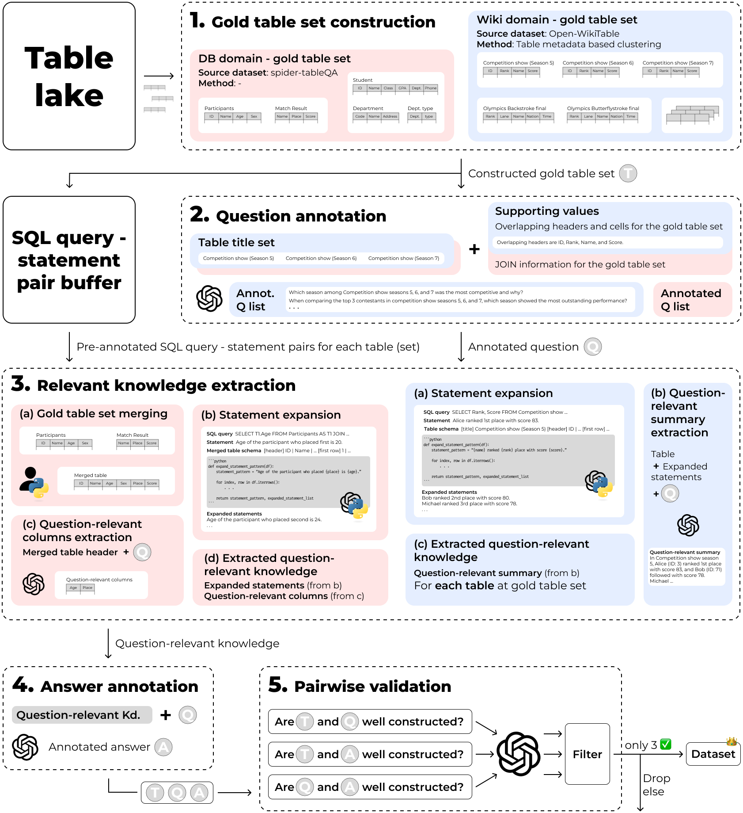

# README

 # TBD

## Package 'utils'

    utils
        TBD

## .gitignore

    .gitignore
    *__pycache__
    *.yaml
    *temp*
    */buffer/*.json
    */buffer/*/*.txt

### utils/.gitignore

    dataset/_class/source/*
    openai/_prompt/assistant/*
    openai/_prompt/system/*
    openai/_prompt/user/*
    !.gitignore
    !*/.gitkeep

## 1. Setup

    TBD

### 1.1 Setup token/key

    from utils.dataset import add_huggingface_access_token
    from utils.openai import add_openai_api_key

    add_huggingface_access_token(token=token)
    add_openai_api_key(api_key=api_key)

### 1.2 Setup prompt

    from utils.openai import save_prompt

    for role in [. . .]: # assistant, system, user
        for task in [. . .]:
            save_prompt(file_path=f'prompt/{role}/{task}.txt', role, task)

## 2. About dataset

### 2.1 Load source dataset

    from utils.dataset import load_source_dataset

    dataset = load_source_dataset(dataset_name=source_dataset_name)

### 2.2 Source dataset configuration

    source_dataset
        .tables
            [
                {
                    'id': [str] each table's ID
                    'metadata': [str] each table's metadata
                    'metadata_info': [str] metadata configuration process
                    'header': [list] each table's header
                    'cell': [2d list] each table's cells
                }
                . . .
            ]
        .train # about train set
            [
                {
                    'gold_table_id_set': [list] gold table IDs
                    'data_list': [
                        {
                            'entailed_table_id_set': [list] entailed table IDs,
                            'nl_query': [str] natural language query
                            'statement': [str] entailed statement
                        },
                        . . .
                    ]
                }
                . . .
            ]
        .validation # about validation set
            # DITTO
        .test    # about test set
            # DITTO
    
    print(source_dataset) # return source dataset name
    print(source_dataset[i / i:j]) # return i'th / (i ~ j-1)'th data; train, validation, test set in order
    print(len(source_dataset)) # return total source dataset size

### 2.3 Original dataset configuration (Don't need to use)

    original_dataset
        .download_type # [str] huggingface or local
        .tables
            [
                {
                    'id': [str] each table's ID
                    'metadata': [str] each table's metadata
                    'metadata_info': [str] metadata configuration process
                    'header': [list] each table's header
                    'cell': [2d list] each table's cells
                    'source': [str] each table's source (None in case not specified)
                },
                . . .
            ]
        .train # about train set
            [
                {
                    'gold_tables': [list] gold table IDs
                    'question': [str] each data's annotated question
                    'answer': [str] each data's annotated answer # can be tuple
                    'answer_type': [str] sentence or table or word or SQL or T/F # can be tuple
                },
                . . .
            ]
        .validation # about validation set
            # DITTO
        .test    # about test set
            # DITTO

    print(original_dataset) # return original dataset name
    print(original_dataset[i / i:j]) # return i'th / (i ~ j-1)'th data; train, validation, test set in order
    print(len(original_dataset)) # return total original dataset size

## 3. Run 'main'

    python3 main.py \
        -d {source_dataset_name, SourceDB or SourceWikipeida}
        -n {number_of_sampled_data}
